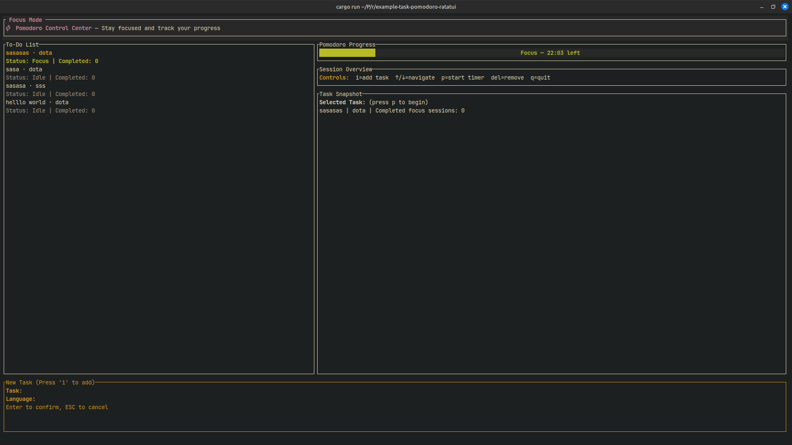
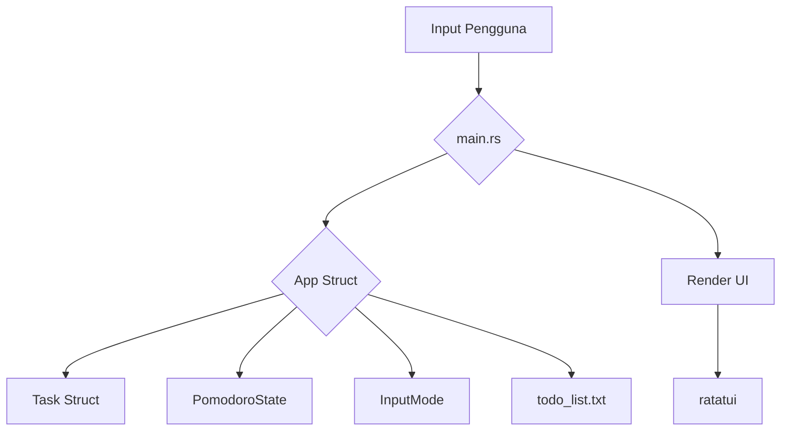

# Todo TUI dengan Timer Pomodoro

Aplikasi To-Do sederhana berbasis terminal dengan timer Pomodoro bawaan untuk membantu Anda tetap fokus.




## Ringkasan Proyek

Ini adalah alat baris perintah sederhana untuk mengelola tugas Anda dan menggunakan teknik Pomodoro untuk tetap fokus. Aplikasi ini dibuat dengan Rust dan menggunakan pustaka `ratatui` untuk membuat antarmuka pengguna terminal.

### Fitur

- Tambah, hapus, dan navigasi tugas Anda.
- Mulai timer Pomodoro untuk tugas yang dipilih.
- Aplikasi akan memberitahu Anda kapan harus istirahat.
- Tugas Anda disimpan dalam file `todo_list.txt`.

## Arsitektur

Aplikasi ini dibangun dengan arsitektur sederhana. Komponen utamanya adalah:

- **`main.rs`**: Titik masuk aplikasi. Ini menangani loop utama, input pengguna, dan me-render UI.
- **`App` struct**: Menyimpan status aplikasi, termasuk daftar tugas, input pengguna, dan tugas yang dipilih.
- **`Task` struct**: Mewakili satu tugas dengan nama, bahasa, status Pomodoro, dan jumlah Pomodoro yang selesai.
- **`PomodoroState` enum**: Mewakili status timer Pomodoro (Idle, Work, atau Break).
- **`InputMode` enum**: Mewakili mode input aplikasi (Tugas, Bahasa, atau Tanpa Mengetik).



## Cara Menjalankan

1.  **Klon repositori:**

    ```bash
    git clone https://github.com/MamangRust/example-task-pomodoro-ratatui.git
    cd example-task-pomodoro-ratatui
    ```

2.  **Bangun proyek:**

    ```bash
    cargo build --release
    ```

3.  **Jalankan aplikasi:**

    ```bash
    ./target/release/todo-tui
    ```

### Kontrol

- `i`: Tambah tugas baru.
- `↑`/`↓`: Navigasi antar tugas.
- `p`: Mulai atau jeda timer Pomodoro.
- `del`: Hapus tugas.
- `q`: Keluar dari aplikasi.
- `esc`: Batalkan pembuatan tugas.
- `enter`: Konfirmasi pembuatan tugas.
